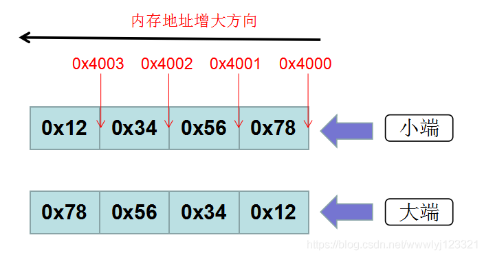

## 大小端示意图

一个 32 位 int 型 **0x12345678**



低序字节存储在起始地址，成为小端

高字节序存储在起始地址，成为大端

这个变量的地址 _(&var)_ 就是 0x4000 即上图右边那个地址。

## 如何确定大小端

``` c++
int is_little_endian(void)
{
	union myunion u1;
	u1.a = 0x12345678;				// 地址0的那个字节内是0x78（小端）或者0x12（大端）
    if(0x78 == u1.b)
        return 1;
    else if(0x12 == u1.b)
	    return 0;
}
// union 变量各成员的地址都是一样的 
// &u1.a == &u1.b

int is_little_endian2(void)
{
	int a = 0x12345678;
	char b = *((char *)(&a));		// 指针方式其实就是共用体的本质
	if(0x78 == b)
        return 1;
    else if(0x12 == b)
	    return 0;
}
```